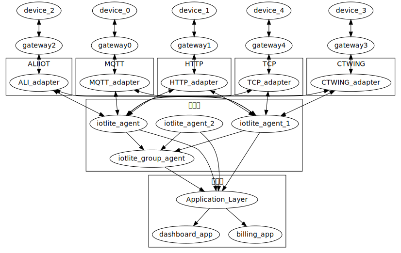

# IOTLITE
简单易用的物联网平台
### 总体流程图


### 设备工作流程图


## 快速体验

或者直接docker pull
```
docker pull jingdor/iotlite
```

或者单独启动 指定 redis 和 mysql
```
docker run -d --name mysql -p 3306:3306/tcp -e MYSQL_ROOT_PASSWORD=root  percona/percona-server:8.0
docker run -d --link mysql:db -p 4021:80/tcp iotlite
```
## 测试环境体验

http://iotlite.crtrpt.com

